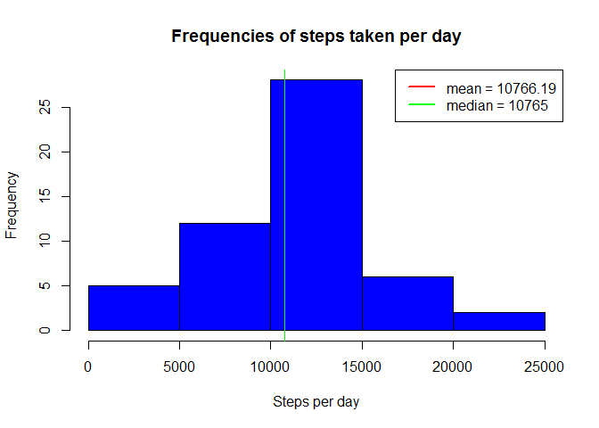
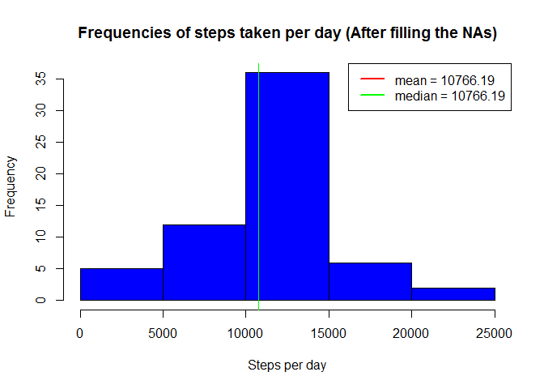
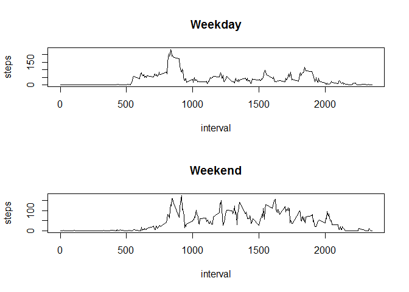

# Reproducible Research: Peer Assessment 1


## Loading and preprocessing the data
First we are checking whether the raw data zip file (activity.zip) exists and if so, extracts it.  
Then we can read in the data using read.csv()

```r
## check for the raw data zip file and extract it
if (file.exists("activity.zip")) { 
    unzip("activity.zip")
}

activityData <- read.csv("activity.csv")
```
Let's see a summary of the data

```r
summary(activityData)
```

```
##      steps                date          interval     
##  Min.   :  0.00   2012-10-01:  288   Min.   :   0.0  
##  1st Qu.:  0.00   2012-10-02:  288   1st Qu.: 588.8  
##  Median :  0.00   2012-10-03:  288   Median :1177.5  
##  Mean   : 37.38   2012-10-04:  288   Mean   :1177.5  
##  3rd Qu.: 12.00   2012-10-05:  288   3rd Qu.:1766.2  
##  Max.   :806.00   2012-10-06:  288   Max.   :2355.0  
##  NA's   :2304     (Other)   :15840
```

## What is mean total number of steps taken per day?
Calculating the total number of steps taken per day

```r
activityDataPerDay <- select(activityData, steps, date)
activityDataPerDay <- activityDataPerDay %>% group_by(date)
activityDataPerDay <- activityDataPerDay %>% summarise_each(funs(sum))

## remove missing values
activityDataPerDay <- activityDataPerDay[complete.cases(activityDataPerDay),]
```
Let's view the per day steps data

```r
head(activityDataPerDay)
```

```
## Source: local data frame [6 x 2]
## 
##         date steps
## 1 2012-10-02   126
## 2 2012-10-03 11352
## 3 2012-10-04 12116
## 4 2012-10-05 13294
## 5 2012-10-06 15420
## 6 2012-10-07 11015
```
Calculate the mean and median of the steps per day

```r
meanStepsPerDay <- mean(activityDataPerDay$steps)
medianStepsPerDay <- median(activityDataPerDay$steps)
```
The mean steps per day is 10766.1886792453 and median steps per day is 10765

Histogram of the steps taken per day

```r
hist(activityDataPerDay$steps, xlab = "Steps per day", main = "Frequencies of steps taken per day", col = "blue")
abline(v = meanStepsPerDay, col = "red", lwd = 1)
abline(v = medianStepsPerDay, col = "green", lwd = 1)
legend("topright", col = c("red", "green"), legend = c(paste("mean =", round(meanStepsPerDay, 2)), paste("median =", medianStepsPerDay)), lwd = 2, lty= 1)
```

 

## What is the average daily activity pattern?
Calculating the daily activity pattern by averaging across all days

```r
activityPattern <- select(activityData, steps, interval)
activityPattern <- activityPattern[complete.cases(activityPattern),]
activityPattern <- activityPattern %>% group_by(interval)
activityPattern <- activityPattern %>% summarise_each(funs(mean))
```


```r
with(activityPattern, 
     plot(interval, steps, type = "l")
     )
```

 

Maximum number of steps averaged across all days is 206.1698113

## Imputing missing values
Calculating the number of rows with missig (NA) data

```r
missingDataCount <- nrow(activityData) - sum(complete.cases(activityData))
```
There are 2304 rows with missing data

To fill the missing values, we first define a function to check whether step vales are missing, and if so fill it with the average value for that interval. We will reuse the *activityPattern* values calculated above

```r
fillNA <- function(rowSteps, rowInterval) {
	rowStepsOut <- rowSteps
	
	for(i in 1:length(rowSteps)){
		if (is.na(rowSteps[i])) {
			rowStepsOut[i] <- activityPattern[activityPattern$interval == rowInterval[i], ]$steps
		}
	}
	rowStepsOut
}
```

Then we would apply this function to our data

```r
activityDataFilled <- activityData ## copy the dataframe to preserve the original
activityDataFilled <- mutate(activityDataFilled, steps = fillNA(steps, interval))
```

Re-calculating the total number of steps taken per day with the new data

```r
activityDataPerDayNew <- select(activityDataFilled, steps, date)
activityDataPerDayNew <- activityDataPerDayNew %>% group_by(date)
activityDataPerDayNew <- activityDataPerDayNew %>% summarise_each(funs(sum))

## remove missing values
activityDataPerDayNew <- activityDataPerDayNew[complete.cases(activityDataPerDayNew),]
```

Calculate the new mean and median of the steps per day

```r
meanStepsPerDayNew <- mean(activityDataPerDayNew$steps)
medianStepsPerDayNew <- median(activityDataPerDayNew$steps)
```
The mean steps per day is 10766.1886792453 and median steps per day is 10766.1886792453  
The original mean steps per day is 10766.1886792453 and original median steps per day is 10765

Histogram of the steps taken per day

```r
hist(activityDataPerDayNew$steps, xlab = "Steps per day", main = "Frequencies of steps taken per day (After filling the NAs)", col = "blue")
abline(v = meanStepsPerDayNew, col = "red", lwd = 1)
abline(v = medianStepsPerDayNew, col = "green", lwd = 1)
legend("topright", col = c("red", "green"), legend = c(paste("mean =", round(meanStepsPerDayNew, 2)), paste("median =", round(medianStepsPerDayNew, 2))), lwd = 2, lty= 1)
```

 

The mean value has not been changed. However the median is now equal to the mean.

## Are there differences in activity patterns between weekdays and weekends?
First, we'll create a function to check whether a day is weekend or nor

```r
checkWeekday <- function(dayVal) {
	wdVal <- weekdays(as.Date(dayVal, "%Y-%m-%d"))
	wdVal == "Saturday" | wdVal == "Sunday"
}
```

Then we would apply this function to our data

```r
activityDataWD <- activityData ## copy the dataframe to preserve the original
activityDataWD <- mutate(activityDataWD, weekend = checkWeekday(date))

activityDataWD$weekend <- as.factor(activityDataWD$weekend) ## factorize the new column
```

We then split the data in to weekday and weekend sets and calculate the averages

```r
activityDataWeekday <- activityDataWD[activityDataWD$weekend == FALSE, ]
activityDataWeekend <- activityDataWD[activityDataWD$weekend == TRUE, ]

activityPatternWD <- select(activityDataWeekday, steps, interval)
activityPatternWD <- activityPatternWD[complete.cases(activityPatternWD),]
activityPatternWD <- activityPatternWD %>% group_by(interval)
activityPatternWD <- activityPatternWD %>% summarise_each(funs(mean))

activityPatternWE <- select(activityDataWeekend, steps, interval)
activityPatternWE <- activityPatternWE[complete.cases(activityPatternWE),]
activityPatternWE <- activityPatternWE %>% group_by(interval)
activityPatternWE <- activityPatternWE %>% summarise_each(funs(mean))
```

We can now view the data for weekday vs weekend

```r
par(mfrow = c(2, 1))
with(activityPatternWD, 
     plot(interval, steps, type = "l", main = "Weekday")
     )
	 
with(activityPatternWE, 
     plot(interval, steps, type = "l", main = "Weekend")
     )
```

 
